# `timeseries` package for fastai2
> **`timeseries`** is a Timeseries Classification and Regression package for fastai2.


<a href="https://colab.research.google.com/github/ai-fast-track/timeseries/blob/master/nbs/index.ipynb" target="_parent"></a>

 [timeseries package documentation](https://ai-fast-track.github.io/timeseries/)

## Installation
> There are may ways to install `timeseries` package. Since `timeseries` is built using `fastai2`, there are also different ways to install fastai2. We will show 2 differents ways to install them and explain the motivation behin each one of them.

### Method 1 : Editable Version
#### 1A - Installing fastai2
> Important :Only if you have not already installed `fastai2`,install [fastai2](https://dev.fast.ai/#Installing) by following the steps described there.

#### 1B - Installing `timeseries` on a local machine
> Note :Installing an editable version of a package means that you will install a package from its corresponding github repository on your local machine. By doing so, you can pull the latest version whenever a new version is pushed.
To install `timeseries` editable package, follow the instructions here below:

```
git clone https://github.com/ai-fast-track/timeseries.git
cd timeseries
pip install -e .
```

### Method 2 : Non Editable version
> Note :Everytime you run the `!pip install git+https:// ...`, you are installing the package latest version stored on github. > Important :As both fastai2 and `timeseries` are still under development, this is an easy way to use them in Google Colab or any other online platform. You can also use it on your local machine.

#### 2A - Installing `fastai2` from its github repository

```
# Run this cell to install the latest version of fastai shared on github
!pip install git+https://github.com/fastai/fastai2.git
```

```
# Run this cell to install the latest version of fastcore shared on github
!pip install git+https://github.com/fastai/fastcore.git
```

#### 2B - Installing `timeseries` from its github repository

```
# Run this cell to install the latest version of timeseries shared on github
!pip install git+https://github.com/ai-fast-track/timeseries.git
```

## `Usage`

```
%reload_ext autoreload
%autoreload 2
%matplotlib inline
```

    The history saving thread hit an unexpected error (DatabaseError('database disk image is malformed',)).History will not be written to the database.


```
from fastai2.basics import *
```

```
from timeseries.all import *
```

## Tutorial on timeseries package for fastai2

## Example : NATOS dataset

### Description
The data is generated by sensors on the hands, elbows, wrists and thumbs. The data are the x,y,z coordinates for each of the eight locations. The order of the data is as follows:

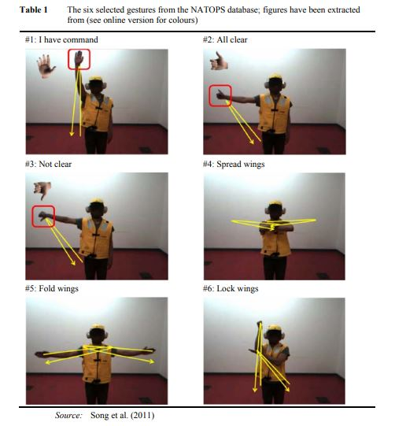

**Right Arm vs Left Arm time series for the 'Not clear' Command ((#3) (see picture here above)**

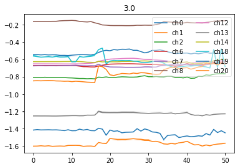
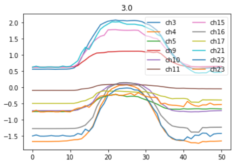

### Channels (24)
| Hand                |  Elbow            | Hand               |  Elbow                |
|:------------------- |:----------------- |:------------------ |:--------------------  | 
| 0. Hand tip left, X | 6. Elbow left, X  | 12.	Wrist left, X  | 18.	Thumb left, X  |
| 1. Hand tip left, Y | 7. Elbow left, Y  | 13.	Wrist left, X  | 19.	Thumb left, X  |
| 2. Hand tip left, Z | 8. Elbow left, Z  | 14.	Wrist left, X  | 20.	Thumb left, X  |
| 3. Hand tip righ, X | 9. Elbow righ, X  | 15.	Wrist righ, X  | 21.	Thumb righ, X  |
| 4. Hand tip righ, Y | 10. Elbow righ, Y | 16.	Wrist righ, X  | 22.	Thumb righ, X  |
| 5. Hand tip righ, Z | 11. Elbow righ, Z | 17.	Wrist righ, X  | 23.	Thumb righ, X  |


### Classes (6)

The six classes are separate actions, with the following meaning:

|                   |                |                |                |                |                       |
|:----------------- |:-------------- |:-------------- |:-------------- |:-------------- |:-------------- |
| 1: I have command | 2: All clear   | 3: Not clear  | 4: Spread wings  | 5: Fold wings |6: Lock wings   |

## Downloading and unzipping a time series dataset

```
dsname =  'NATOPS' #'NATOPS', 'LSST', 'Wine', 'Epilepsy', 'HandMovementDirection'
```

```
# url = 'http://www.timeseriesclassification.com/Downloads/NATOPS.zip'
path = unzip_data(URLs_TS.NATOPS)
path
```


    Path('/home/farid/.fastai/data/NATOPS')


## Why do I have to concatenate train and test data?
Both Train and Train dataset contains 180 samples each. We concatenate them in order to have one big dataset and then split into train and valid dataset using our own split percentage (20%, 30%, or whatever number you see fit)

```
fname_train = f'{dsname}_TRAIN.arff'
fname_test = f'{dsname}_TEST.arff'
fnames = [path/fname_train, path/fname_test]
fnames
```


    [Path('/home/farid/.fastai/data/NATOPS/NATOPS_TRAIN.arff'),
     Path('/home/farid/.fastai/data/NATOPS/NATOPS_TEST.arff')]


```
data = TSData.from_arff(fnames)
print(data)
```

    TSData:
     Datasets names (concatenated): ['NATOPS_TRAIN', 'NATOPS_TEST']
     Filenames:                     [Path('/home/farid/.fastai/data/NATOPS/NATOPS_TRAIN.arff'), Path('/home/farid/.fastai/data/NATOPS/NATOPS_TEST.arff')]
     Data shape: (360, 24, 51)
     Targets shape: (360,)
     Nb Samples: 360
     Nb Channels:           24
     Sequence Length: 51


```
items = data.get_items()
```

```
idx = 1
x1, y1 = data.x[idx],  data.y[idx]
y1
```


    '3.0'


```

# You can select any channel to display buy supplying a list of channels and pass it to `chs` argument
# LEFT ARM
# show_timeseries(x1, title=y1, chs=[0,1,2,6,7,8,12,13,14,18,19,20])

```

```
# RIGHT ARM
# show_timeseries(x1, title=y1, chs=[3,4,5,9,10,11,15,16,17,21,22,23])
```

```
# ?show_timeseries(x1, title=y1, chs=range(0,24,3)) # Only the x axis coordinates

```

```
seed = 42
splits = RandomSplitter(seed=seed)(range_of(items)) #by default 80% for train split and 20% for valid split are chosen 
splits
```


    ((#288) [304,281,114,329,115,130,338,294,94,310...],
     (#72) [222,27,96,253,274,35,160,172,302,146...])


## Using `Datasets` class

### Creating a Datasets object

```
lbl_dict = dict([
    ('1.0', 'I have command'),   
    ('2.0', 'All clear'),   
    ('3.0', 'Not clear'),   
    ('4.0', 'Spread wings'),   
    ('5.0', 'Fold wings'),   
    ('6.0', 'Lock wings')]
)
```

```
tfms = [[ItemGetter(0), ToTensorTS()], [ItemGetter(1), lbl_dict.get, Categorize()]]

# Create a dataset
ds = Datasets(items, tfms, splits=splits)
```

```
ax = show_at(ds, 2, figsize=(1,1))
```

    Not clear


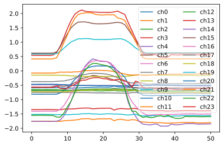


## Creating a `Dataloaders` object

### 1st method : using `Datasets` object

```
bs = 128                            
# Normalize at batch time
tfm_norm = Normalize(scale_subtype = 'per_sample_per_channel', scale_range=(0, 1)) # per_sample , per_sample_per_channel
# tfm_norm = Standardize(scale_subtype = 'per_sample')
batch_tfms = [tfm_norm]

dls1 = ds.dataloaders(bs=bs, val_bs=bs * 2, after_batch=batch_tfms, num_workers=0, device=default_device()) 
```

```
dls1.show_batch(max_n=9, chs=range(0,12,3))
```


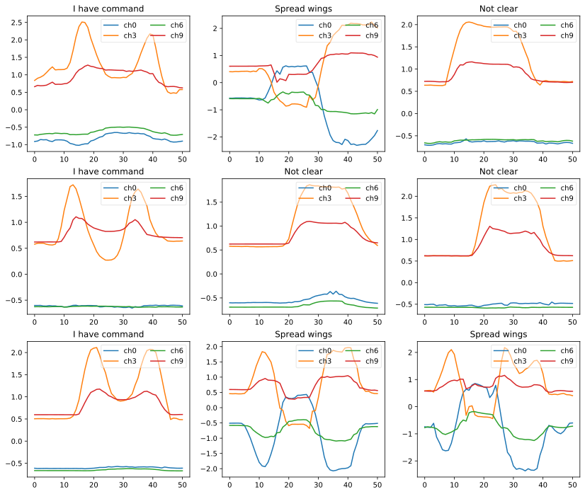


# Using `DataBlock` class

### 2nd method : using `DataBlock` and `DataBlock.get_items()` 

```
tsdb = DataBlock(blocks=(TSBlock, CategoryBlock),
                   get_items=get_ts_items,
                   get_x = ItemGetter(0),
                   get_y = Pipeline([ItemGetter(1), lbl_dict.get]),
                   splitter=RandomSplitter(seed=seed),
                   batch_tfms = batch_tfms)
```

```
tsdb.summary(fnames)
```

    Setting-up type transforms pipelines
    Collecting items from [Path('/home/farid/.fastai/data/NATOPS/NATOPS_TRAIN.arff'), Path('/home/farid/.fastai/data/NATOPS/NATOPS_TEST.arff')]
    Found 360 items
    2 datasets of sizes 288,72
    Setting up Pipeline: ItemGetter -> ToTensorTS
    Setting up Pipeline: ItemGetter -> dict.get -> Categorize
    
    Building one sample
      Pipeline: ItemGetter -> ToTensorTS
        starting from
          ([[-0.540579 -0.54101  -0.540603 ... -0.56305  -0.566314 -0.553712]
     [-1.539567 -1.540042 -1.538992 ... -1.532014 -1.534645 -1.536015]
     [-0.608539 -0.604609 -0.607679 ... -0.593769 -0.592854 -0.599014]
     ...
     [ 0.454542  0.449924  0.453195 ...  0.480281  0.45537   0.457275]
     [-1.411445 -1.363464 -1.390869 ... -1.468123 -1.368706 -1.386574]
     [-0.473406 -0.453322 -0.463813 ... -0.440582 -0.427211 -0.435581]], 2.0)
        applying ItemGetter gives
          [[-0.540579 -0.54101  -0.540603 ... -0.56305  -0.566314 -0.553712]
     [-1.539567 -1.540042 -1.538992 ... -1.532014 -1.534645 -1.536015]
     [-0.608539 -0.604609 -0.607679 ... -0.593769 -0.592854 -0.599014]
     ...
     [ 0.454542  0.449924  0.453195 ...  0.480281  0.45537   0.457275]
     [-1.411445 -1.363464 -1.390869 ... -1.468123 -1.368706 -1.386574]
     [-0.473406 -0.453322 -0.463813 ... -0.440582 -0.427211 -0.435581]]
        applying ToTensorTS gives
          TensorTS of size 24x51
      Pipeline: ItemGetter -> dict.get -> Categorize
        starting from
          ([[-0.540579 -0.54101  -0.540603 ... -0.56305  -0.566314 -0.553712]
     [-1.539567 -1.540042 -1.538992 ... -1.532014 -1.534645 -1.536015]
     [-0.608539 -0.604609 -0.607679 ... -0.593769 -0.592854 -0.599014]
     ...
     [ 0.454542  0.449924  0.453195 ...  0.480281  0.45537   0.457275]
     [-1.411445 -1.363464 -1.390869 ... -1.468123 -1.368706 -1.386574]
     [-0.473406 -0.453322 -0.463813 ... -0.440582 -0.427211 -0.435581]], 2.0)
        applying ItemGetter gives
          2.0
        applying dict.get gives
          All clear
        applying Categorize gives
          TensorCategory(0)
    
    Final sample: (TensorTS([[-0.5406, -0.5410, -0.5406,  ..., -0.5630, -0.5663, -0.5537],
            [-1.5396, -1.5400, -1.5390,  ..., -1.5320, -1.5346, -1.5360],
            [-0.6085, -0.6046, -0.6077,  ..., -0.5938, -0.5929, -0.5990],
            ...,
            [ 0.4545,  0.4499,  0.4532,  ...,  0.4803,  0.4554,  0.4573],
            [-1.4114, -1.3635, -1.3909,  ..., -1.4681, -1.3687, -1.3866],
            [-0.4734, -0.4533, -0.4638,  ..., -0.4406, -0.4272, -0.4356]]), TensorCategory(0))
    
    
    Setting up after_item: Pipeline: ToTensor
    Setting up before_batch: Pipeline: 
    Setting up after_batch: Pipeline: Normalize
    
    Building one batch
    Applying item_tfms to the first sample:
      Pipeline: ToTensor
        starting from
          (TensorTS of size 24x51, TensorCategory(0))
        applying ToTensor gives
          (TensorTS of size 24x51, TensorCategory(0))
    
    Adding the next 3 samples
    
    No before_batch transform to apply
    
    Collating items in a batch
    
    Applying batch_tfms to the batch built
      Pipeline: Normalize
        starting from
          (TensorTS of size 4x24x51, TensorCategory([0, 3, 1, 3]))
        applying Normalize gives
          (TensorTS of size 4x24x51, TensorCategory([0, 3, 1, 3]))


```
# num_workers=0 is Microsoft Windows
dls2 = tsdb.dataloaders(fnames, num_workers=0, device=default_device())
```

```
dls2.show_batch(max_n=9, chs=range(0,12,3))
```


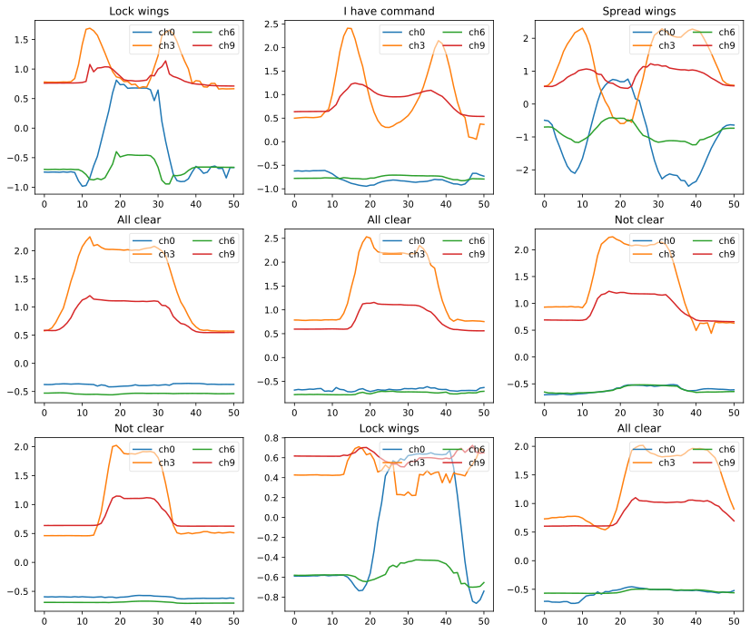


### 3rd method : using `DataBlock` and passing `items` object to the `DataBlock.dataloaders()`

```
# getters = [ItemGetter(0), ItemGetter(1)] 
tsdb = DataBlock(blocks=(TSBlock, CategoryBlock),
                   get_x = ItemGetter(0),
                   get_y = Pipeline([ItemGetter(1), lbl_dict.get]),
                   splitter=RandomSplitter(seed=seed))
```

```
dls3 = tsdb.dataloaders(data.get_items(), batch_tfms=batch_tfms, num_workers=0, device=default_device())
```

```
dls3.show_batch(max_n=9, chs=range(0,12,3))
```


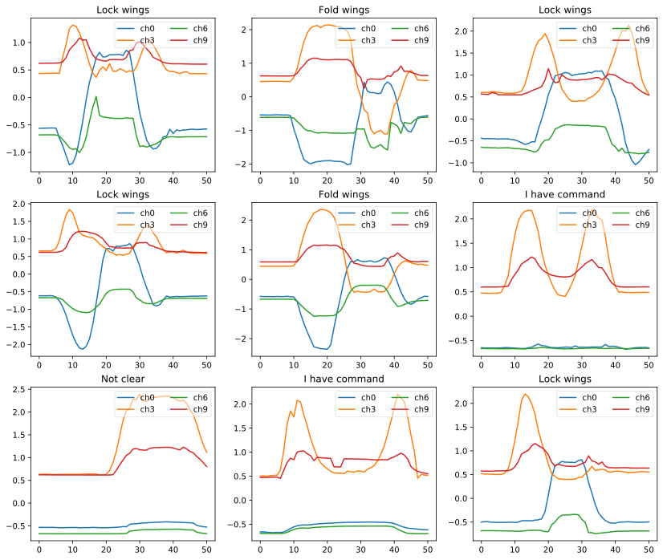


### 4th method : using `TSDataLoaders` class and `TSDataLoaders.from_files()`

```
dls4 = TSDataLoaders.from_files(fnames=fnames, path=path, batch_tfms=batch_tfms, lbl_dict=lbl_dict, num_workers=0, device=default_device())
```

```
dls4.show_batch(max_n=9, chs=range(0,12,3))
```


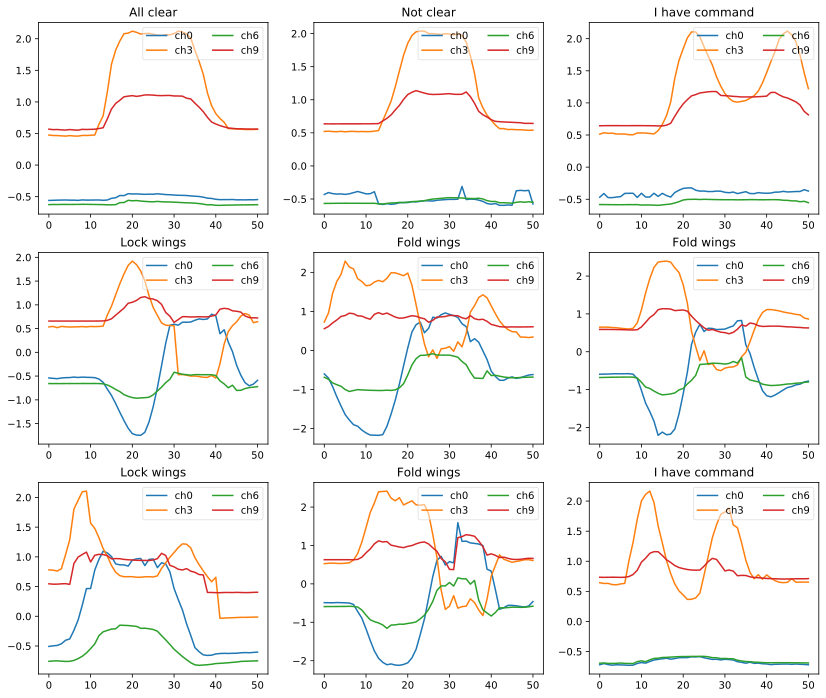


## Training a Model

```
# Number of channels (i.e. dimensions in ARFF and TS files jargon)
c_in = get_n_channels(dls2.train) # data.n_channels
# Number of classes
c_out= dls2.c 
c_in,c_out
```


    (24, 6)


### Creating a model

```
model = inception_time(c_in, c_out).to(device=default_device())
model
```


    Sequential(
      (0): SequentialEx(
        (layers): ModuleList(
          (0): InceptionModule(
            (convs): ModuleList(
              (0): Conv1d(24, 32, kernel_size=(39,), stride=(1,), padding=(19,), bias=False)
              (1): Conv1d(24, 32, kernel_size=(19,), stride=(1,), padding=(9,), bias=False)
              (2): Conv1d(24, 32, kernel_size=(9,), stride=(1,), padding=(4,), bias=False)
            )
            (maxpool_bottleneck): Sequential(
              (0): MaxPool1d(kernel_size=3, stride=1, padding=1, dilation=1, ceil_mode=False)
              (1): Conv1d(24, 32, kernel_size=(1,), stride=(1,), bias=False)
            )
            (bn_relu): Sequential(
              (0): BatchNorm1d(128, eps=1e-05, momentum=0.1, affine=True, track_running_stats=True)
              (1): ReLU()
            )
          )
        )
      )
      (1): SequentialEx(
        (layers): ModuleList(
          (0): InceptionModule(
            (bottleneck): Conv1d(128, 32, kernel_size=(1,), stride=(1,))
            (convs): ModuleList(
              (0): Conv1d(32, 32, kernel_size=(39,), stride=(1,), padding=(19,), bias=False)
              (1): Conv1d(32, 32, kernel_size=(19,), stride=(1,), padding=(9,), bias=False)
              (2): Conv1d(32, 32, kernel_size=(9,), stride=(1,), padding=(4,), bias=False)
            )
            (maxpool_bottleneck): Sequential(
              (0): MaxPool1d(kernel_size=3, stride=1, padding=1, dilation=1, ceil_mode=False)
              (1): Conv1d(128, 32, kernel_size=(1,), stride=(1,), bias=False)
            )
            (bn_relu): Sequential(
              (0): BatchNorm1d(128, eps=1e-05, momentum=0.1, affine=True, track_running_stats=True)
              (1): ReLU()
            )
          )
        )
      )
      (2): SequentialEx(
        (layers): ModuleList(
          (0): InceptionModule(
            (bottleneck): Conv1d(128, 32, kernel_size=(1,), stride=(1,))
            (convs): ModuleList(
              (0): Conv1d(32, 32, kernel_size=(39,), stride=(1,), padding=(19,), bias=False)
              (1): Conv1d(32, 32, kernel_size=(19,), stride=(1,), padding=(9,), bias=False)
              (2): Conv1d(32, 32, kernel_size=(9,), stride=(1,), padding=(4,), bias=False)
            )
            (maxpool_bottleneck): Sequential(
              (0): MaxPool1d(kernel_size=3, stride=1, padding=1, dilation=1, ceil_mode=False)
              (1): Conv1d(128, 32, kernel_size=(1,), stride=(1,), bias=False)
            )
            (bn_relu): Sequential(
              (0): BatchNorm1d(128, eps=1e-05, momentum=0.1, affine=True, track_running_stats=True)
              (1): ReLU()
            )
          )
          (1): Shortcut(
            (act_fn): ReLU(inplace=True)
            (conv): Conv1d(128, 128, kernel_size=(1,), stride=(1,), bias=False)
            (bn): BatchNorm1d(128, eps=1e-05, momentum=0.1, affine=True, track_running_stats=True)
          )
        )
      )
      (3): SequentialEx(
        (layers): ModuleList(
          (0): InceptionModule(
            (bottleneck): Conv1d(128, 32, kernel_size=(1,), stride=(1,))
            (convs): ModuleList(
              (0): Conv1d(32, 32, kernel_size=(39,), stride=(1,), padding=(19,), bias=False)
              (1): Conv1d(32, 32, kernel_size=(19,), stride=(1,), padding=(9,), bias=False)
              (2): Conv1d(32, 32, kernel_size=(9,), stride=(1,), padding=(4,), bias=False)
            )
            (maxpool_bottleneck): Sequential(
              (0): MaxPool1d(kernel_size=3, stride=1, padding=1, dilation=1, ceil_mode=False)
              (1): Conv1d(128, 32, kernel_size=(1,), stride=(1,), bias=False)
            )
            (bn_relu): Sequential(
              (0): BatchNorm1d(128, eps=1e-05, momentum=0.1, affine=True, track_running_stats=True)
              (1): ReLU()
            )
          )
        )
      )
      (4): SequentialEx(
        (layers): ModuleList(
          (0): InceptionModule(
            (bottleneck): Conv1d(128, 32, kernel_size=(1,), stride=(1,))
            (convs): ModuleList(
              (0): Conv1d(32, 32, kernel_size=(39,), stride=(1,), padding=(19,), bias=False)
              (1): Conv1d(32, 32, kernel_size=(19,), stride=(1,), padding=(9,), bias=False)
              (2): Conv1d(32, 32, kernel_size=(9,), stride=(1,), padding=(4,), bias=False)
            )
            (maxpool_bottleneck): Sequential(
              (0): MaxPool1d(kernel_size=3, stride=1, padding=1, dilation=1, ceil_mode=False)
              (1): Conv1d(128, 32, kernel_size=(1,), stride=(1,), bias=False)
            )
            (bn_relu): Sequential(
              (0): BatchNorm1d(128, eps=1e-05, momentum=0.1, affine=True, track_running_stats=True)
              (1): ReLU()
            )
          )
        )
      )
      (5): SequentialEx(
        (layers): ModuleList(
          (0): InceptionModule(
            (bottleneck): Conv1d(128, 32, kernel_size=(1,), stride=(1,))
            (convs): ModuleList(
              (0): Conv1d(32, 32, kernel_size=(39,), stride=(1,), padding=(19,), bias=False)
              (1): Conv1d(32, 32, kernel_size=(19,), stride=(1,), padding=(9,), bias=False)
              (2): Conv1d(32, 32, kernel_size=(9,), stride=(1,), padding=(4,), bias=False)
            )
            (maxpool_bottleneck): Sequential(
              (0): MaxPool1d(kernel_size=3, stride=1, padding=1, dilation=1, ceil_mode=False)
              (1): Conv1d(128, 32, kernel_size=(1,), stride=(1,), bias=False)
            )
            (bn_relu): Sequential(
              (0): BatchNorm1d(128, eps=1e-05, momentum=0.1, affine=True, track_running_stats=True)
              (1): ReLU()
            )
          )
          (1): Shortcut(
            (act_fn): ReLU(inplace=True)
            (conv): Conv1d(128, 128, kernel_size=(1,), stride=(1,), bias=False)
            (bn): BatchNorm1d(128, eps=1e-05, momentum=0.1, affine=True, track_running_stats=True)
          )
        )
      )
      (6): AdaptiveConcatPool1d(
        (ap): AdaptiveAvgPool1d(output_size=1)
        (mp): AdaptiveMaxPool1d(output_size=1)
      )
      (7): Flatten(full=False)
      (8): Linear(in_features=256, out_features=6, bias=True)
    )


### Creating a Learner object

```
# opt_func = partial(Adam, lr=3e-3, wd=0.01)
#Or use Ranger
def opt_func(p, lr=slice(3e-3)): return Lookahead(RAdam(p, lr=lr, mom=0.95, wd=0.01)) 
```

```
#Learner    
loss_func = LabelSmoothingCrossEntropy() 
learn = Learner(dls2, model, opt_func=opt_func, loss_func=loss_func, metrics=accuracy)

print(learn.summary())
```

    Sequential (Input shape: ['64 x 24 x 51'])
    ================================================================
    Layer (type)         Output Shape         Param #    Trainable 
    ================================================================
    Conv1d               64 x 32 x 51         29,952     True      
    ________________________________________________________________
    Conv1d               64 x 32 x 51         14,592     True      
    ________________________________________________________________
    Conv1d               64 x 32 x 51         6,912      True      
    ________________________________________________________________
    MaxPool1d            64 x 24 x 51         0          False     
    ________________________________________________________________
    Conv1d               64 x 32 x 51         768        True      
    ________________________________________________________________
    BatchNorm1d          64 x 128 x 51        256        True      
    ________________________________________________________________
    ReLU                 64 x 128 x 51        0          False     
    ________________________________________________________________
    Conv1d               64 x 32 x 51         4,128      True      
    ________________________________________________________________
    Conv1d               64 x 32 x 51         39,936     True      
    ________________________________________________________________
    Conv1d               64 x 32 x 51         19,456     True      
    ________________________________________________________________
    Conv1d               64 x 32 x 51         9,216      True      
    ________________________________________________________________
    MaxPool1d            64 x 128 x 51        0          False     
    ________________________________________________________________
    Conv1d               64 x 32 x 51         4,096      True      
    ________________________________________________________________
    BatchNorm1d          64 x 128 x 51        256        True      
    ________________________________________________________________
    ReLU                 64 x 128 x 51        0          False     
    ________________________________________________________________
    Conv1d               64 x 32 x 51         4,128      True      
    ________________________________________________________________
    Conv1d               64 x 32 x 51         39,936     True      
    ________________________________________________________________
    Conv1d               64 x 32 x 51         19,456     True      
    ________________________________________________________________
    Conv1d               64 x 32 x 51         9,216      True      
    ________________________________________________________________
    MaxPool1d            64 x 128 x 51        0          False     
    ________________________________________________________________
    Conv1d               64 x 32 x 51         4,096      True      
    ________________________________________________________________
    BatchNorm1d          64 x 128 x 51        256        True      
    ________________________________________________________________
    ReLU                 64 x 128 x 51        0          False     
    ________________________________________________________________
    ReLU                 64 x 128 x 51        0          False     
    ________________________________________________________________
    Conv1d               64 x 128 x 51        16,384     True      
    ________________________________________________________________
    BatchNorm1d          64 x 128 x 51        256        True      
    ________________________________________________________________
    Conv1d               64 x 32 x 51         4,128      True      
    ________________________________________________________________
    Conv1d               64 x 32 x 51         39,936     True      
    ________________________________________________________________
    Conv1d               64 x 32 x 51         19,456     True      
    ________________________________________________________________
    Conv1d               64 x 32 x 51         9,216      True      
    ________________________________________________________________
    MaxPool1d            64 x 128 x 51        0          False     
    ________________________________________________________________
    Conv1d               64 x 32 x 51         4,096      True      
    ________________________________________________________________
    BatchNorm1d          64 x 128 x 51        256        True      
    ________________________________________________________________
    ReLU                 64 x 128 x 51        0          False     
    ________________________________________________________________
    Conv1d               64 x 32 x 51         4,128      True      
    ________________________________________________________________
    Conv1d               64 x 32 x 51         39,936     True      
    ________________________________________________________________
    Conv1d               64 x 32 x 51         19,456     True      
    ________________________________________________________________
    Conv1d               64 x 32 x 51         9,216      True      
    ________________________________________________________________
    MaxPool1d            64 x 128 x 51        0          False     
    ________________________________________________________________
    Conv1d               64 x 32 x 51         4,096      True      
    ________________________________________________________________
    BatchNorm1d          64 x 128 x 51        256        True      
    ________________________________________________________________
    ReLU                 64 x 128 x 51        0          False     
    ________________________________________________________________
    Conv1d               64 x 32 x 51         4,128      True      
    ________________________________________________________________
    Conv1d               64 x 32 x 51         39,936     True      
    ________________________________________________________________
    Conv1d               64 x 32 x 51         19,456     True      
    ________________________________________________________________
    Conv1d               64 x 32 x 51         9,216      True      
    ________________________________________________________________
    MaxPool1d            64 x 128 x 51        0          False     
    ________________________________________________________________
    Conv1d               64 x 32 x 51         4,096      True      
    ________________________________________________________________
    BatchNorm1d          64 x 128 x 51        256        True      
    ________________________________________________________________
    ReLU                 64 x 128 x 51        0          False     
    ________________________________________________________________
    ReLU                 64 x 128 x 51        0          False     
    ________________________________________________________________
    Conv1d               64 x 128 x 51        16,384     True      
    ________________________________________________________________
    BatchNorm1d          64 x 128 x 51        256        True      
    ________________________________________________________________
    AdaptiveAvgPool1d    64 x 128 x 1         0          False     
    ________________________________________________________________
    AdaptiveMaxPool1d    64 x 128 x 1         0          False     
    ________________________________________________________________
    Flatten              64 x 256             0          False     
    ________________________________________________________________
    Linear               64 x 6               1,542      True      
    ________________________________________________________________
    
    Total params: 472,742
    Total trainable params: 472,742
    Total non-trainable params: 0
    
    Optimizer used: <function opt_func at 0x7fb11c99f400>
    Loss function: LabelSmoothingCrossEntropy()
    
    Callbacks:
      - TrainEvalCallback
      - Recorder
      - ProgressCallback


### LR find 

```
lr_min, lr_steep = learn.lr_find()
lr_min, lr_steep
```


<div>
    <style>
        /* Turns off some styling */
        progress {
            /* gets rid of default border in Firefox and Opera. */
            border: none;
            /* Needs to be in here for Safari polyfill so background images work as expected. */
            background-size: auto;
        }
        .progress-bar-interrupted, .progress-bar-interrupted::-webkit-progress-bar {
            background: #F44336;
        }
    </style>
  <progress value='0' class='' max='26', style='width:300px; height:20px; vertical-align: middle;'></progress>

</div>


    (0.00831763744354248, 0.0006918309954926372)


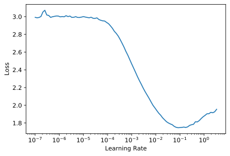


### Train

```
learn.fit_one_cycle(25, lr_max=1e-3)
```


<table border="1" class="dataframe">
  <thead>
    <tr style="text-align: left;">
      <th>epoch</th>
      <th>train_loss</th>
      <th>valid_loss</th>
      <th>accuracy</th>
      <th>time</th>
    </tr>
  </thead>
  <tbody>
    <tr>
      <td>0</td>
      <td>3.001498</td>
      <td>1.795478</td>
      <td>0.222222</td>
      <td>00:01</td>
    </tr>
    <tr>
      <td>1</td>
      <td>2.909164</td>
      <td>1.799713</td>
      <td>0.222222</td>
      <td>00:01</td>
    </tr>
    <tr>
      <td>2</td>
      <td>2.758937</td>
      <td>1.805732</td>
      <td>0.222222</td>
      <td>00:01</td>
    </tr>
    <tr>
      <td>3</td>
      <td>2.552927</td>
      <td>1.810526</td>
      <td>0.222222</td>
      <td>00:01</td>
    </tr>
    <tr>
      <td>4</td>
      <td>2.272452</td>
      <td>1.817920</td>
      <td>0.180556</td>
      <td>00:02</td>
    </tr>
    <tr>
      <td>5</td>
      <td>1.995428</td>
      <td>1.829209</td>
      <td>0.111111</td>
      <td>00:02</td>
    </tr>
    <tr>
      <td>6</td>
      <td>1.776214</td>
      <td>1.749636</td>
      <td>0.222222</td>
      <td>00:01</td>
    </tr>
    <tr>
      <td>7</td>
      <td>1.597963</td>
      <td>1.653429</td>
      <td>0.347222</td>
      <td>00:02</td>
    </tr>
    <tr>
      <td>8</td>
      <td>1.453098</td>
      <td>1.463801</td>
      <td>0.444444</td>
      <td>00:02</td>
    </tr>
    <tr>
      <td>9</td>
      <td>1.337819</td>
      <td>1.185544</td>
      <td>0.666667</td>
      <td>00:01</td>
    </tr>
    <tr>
      <td>10</td>
      <td>1.241440</td>
      <td>0.982497</td>
      <td>0.777778</td>
      <td>00:02</td>
    </tr>
    <tr>
      <td>11</td>
      <td>1.160481</td>
      <td>0.845832</td>
      <td>0.819444</td>
      <td>00:02</td>
    </tr>
    <tr>
      <td>12</td>
      <td>1.089517</td>
      <td>0.751684</td>
      <td>0.833333</td>
      <td>00:02</td>
    </tr>
    <tr>
      <td>13</td>
      <td>1.026505</td>
      <td>0.733695</td>
      <td>0.833333</td>
      <td>00:02</td>
    </tr>
    <tr>
      <td>14</td>
      <td>0.973174</td>
      <td>0.693617</td>
      <td>0.861111</td>
      <td>00:02</td>
    </tr>
    <tr>
      <td>15</td>
      <td>0.926334</td>
      <td>0.686428</td>
      <td>0.805556</td>
      <td>00:02</td>
    </tr>
    <tr>
      <td>16</td>
      <td>0.884449</td>
      <td>0.684725</td>
      <td>0.875000</td>
      <td>00:02</td>
    </tr>
    <tr>
      <td>17</td>
      <td>0.848235</td>
      <td>0.659447</td>
      <td>0.833333</td>
      <td>00:02</td>
    </tr>
    <tr>
      <td>18</td>
      <td>0.814864</td>
      <td>0.654701</td>
      <td>0.847222</td>
      <td>00:02</td>
    </tr>
    <tr>
      <td>19</td>
      <td>0.784517</td>
      <td>0.654098</td>
      <td>0.875000</td>
      <td>00:02</td>
    </tr>
    <tr>
      <td>20</td>
      <td>0.757529</td>
      <td>0.648219</td>
      <td>0.875000</td>
      <td>00:02</td>
    </tr>
    <tr>
      <td>21</td>
      <td>0.732877</td>
      <td>0.649778</td>
      <td>0.861111</td>
      <td>00:02</td>
    </tr>
    <tr>
      <td>22</td>
      <td>0.710833</td>
      <td>0.644054</td>
      <td>0.875000</td>
      <td>00:02</td>
    </tr>
    <tr>
      <td>23</td>
      <td>0.691595</td>
      <td>0.641094</td>
      <td>0.875000</td>
      <td>00:02</td>
    </tr>
    <tr>
      <td>24</td>
      <td>0.674118</td>
      <td>0.639970</td>
      <td>0.861111</td>
      <td>00:02</td>
    </tr>
  </tbody>
</table>


### Ploting the loss function

```
learn.recorder.plot_loss()
```


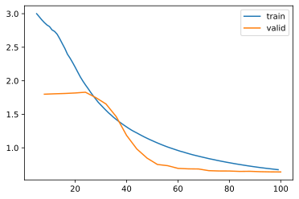


### Showing the results

```
learn.show_results(max_n=9, chs=range(0,12,3))
```


<div>
    <style>
        /* Turns off some styling */
        progress {
            /* gets rid of default border in Firefox and Opera. */
            border: none;
            /* Needs to be in here for Safari polyfill so background images work as expected. */
            background-size: auto;
        }
        .progress-bar-interrupted, .progress-bar-interrupted::-webkit-progress-bar {
            background: #F44336;
        }
    </style>
  <progress value='0' class='' max='1', style='width:300px; height:20px; vertical-align: middle;'></progress>

</div>


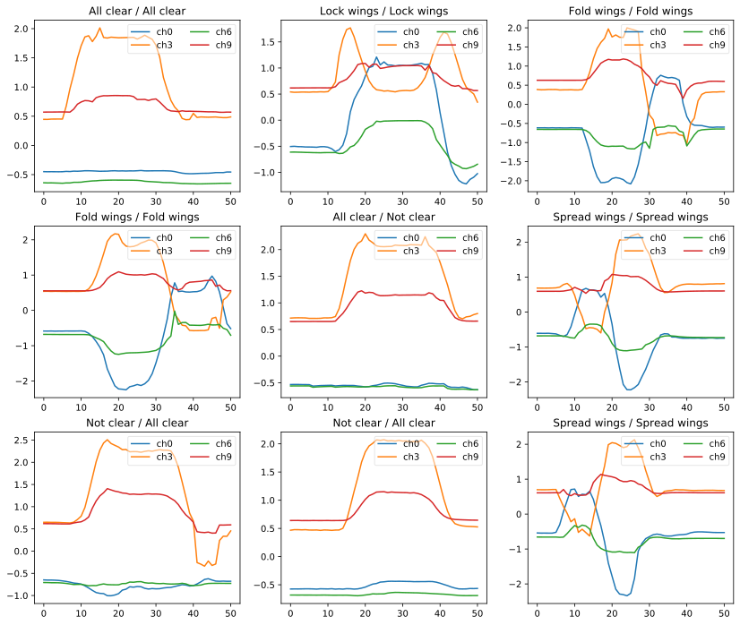


### Showing the confusion matrix

```
interp = ClassificationInterpretation.from_learner(learn)
interp.plot_confusion_matrix(figsize=(10,8))
```


<div>
    <style>
        /* Turns off some styling */
        progress {
            /* gets rid of default border in Firefox and Opera. */
            border: none;
            /* Needs to be in here for Safari polyfill so background images work as expected. */
            background-size: auto;
        }
        .progress-bar-interrupted, .progress-bar-interrupted::-webkit-progress-bar {
            background: #F44336;
        }
    </style>
  <progress value='0' class='' max='2', style='width:300px; height:20px; vertical-align: middle;'></progress>

</div>


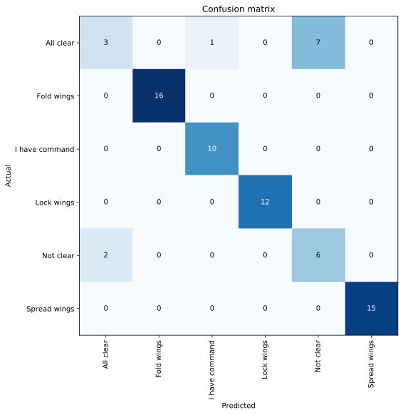


