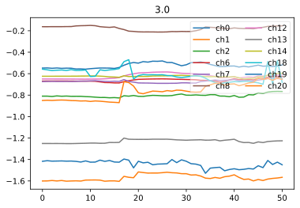
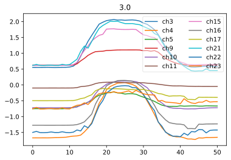
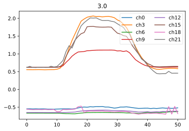
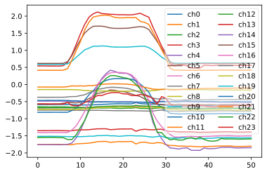
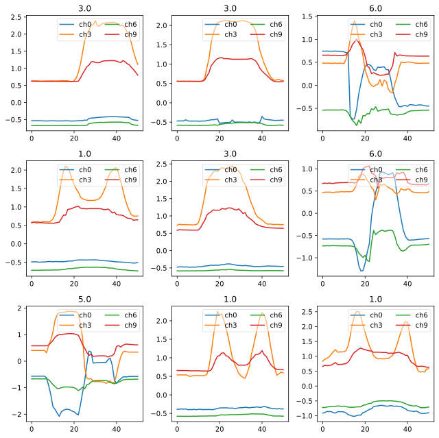
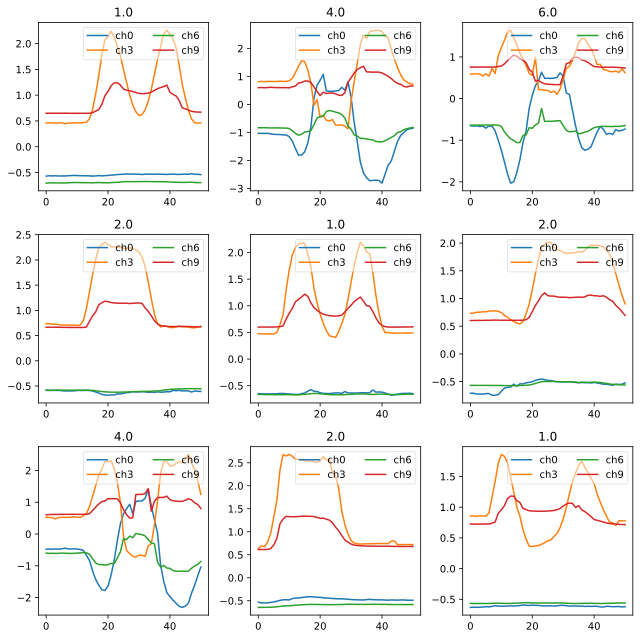
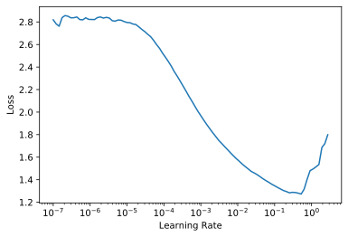
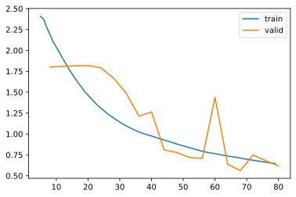
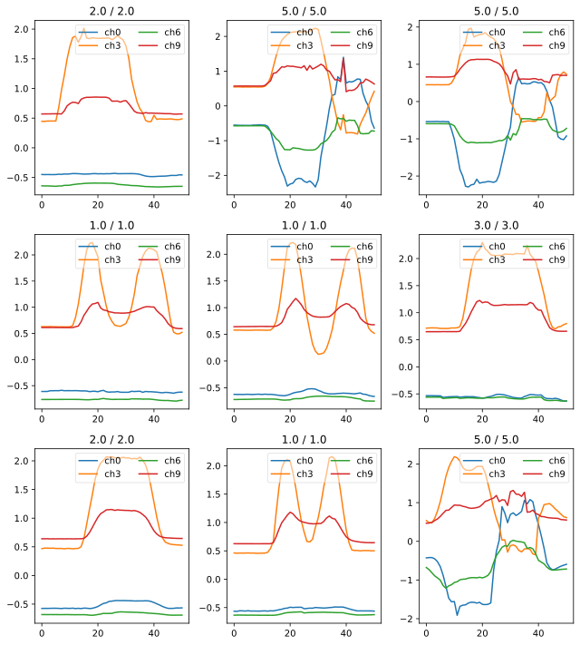

# Tutorial - Using `timeseries` APIs
> Using `Datasets` and `DataBlock`


```python
%reload_ext autoreload
%autoreload 2
%matplotlib inline
```

```python
from fastai2.basics import *
```

```python
from timeseries.all import *
# from timeseries.data import *
# from timeseries.core import *
# from timeseries.models.inception_time import *
```

# Tutorial on timeseries module for fastai v2

## Example : NATOS dataset


## Right Arm vs Left Arm (3: 'Not clear' Command (see picture here above))
<br>


## Description
The data is generated by sensors on the hands, elbows, wrists and thumbs. The data are the x,y,z coordinates for each of the eight locations. The order of the data is as follows:

## Channels (24)
0.	Hand tip left, X coordinate
1.	Hand tip left, Y coordinate
2.	Hand tip left, Z coordinate
3.	Hand tip right, X coordinate
4.	Hand tip right, Y coordinate
5.	Hand tip right, Z coordinate
6.	Elbow left, X coordinate
7.	Elbow left, Y coordinate
8.	Elbow left, Z coordinate
9.	Elbow right, X coordinate
10.	Elbow right, Y coordinate
11.	Elbow right, Z coordinate
12.	Wrist left, X coordinate
13.	Wrist left, Y coordinate
14.	Wrist left, Z coordinate
15.	Wrist right, X coordinate
16.	Wrist right, Y coordinate
17.	Wrist right, Z coordinate
18.	Thumb left, X coordinate
19.	Thumb left, Y coordinate
20.	Thumb left, Z coordinate
21.	Thumb right, X coordinate
22.	Thumb right, Y coordinate
23.	Thumb right, Z coordinate

## Classes (6)
The six classes are separate actions, with the following meaning:
 
1: I have command 
2: All clear 
3: Not clear 
4: Spread wings 
5: Fold wings 
6: Lock wings

## Download data using `download_unzip_data_UCR(dsname=dsname)` method

```python
# path_data = Config().data
# path_data, path_data.ls()
```

```python
dsname =  'NATOPS' #'NATOPS', 'LSST', 'Wine', 'Epilepsy', 'HandMovementDirection'
```

```python
path = download_unzip_data_UCR(dsname=dsname)
path.ls()
```


    (#54) [Path('C:/Users/fh/.fastai/data/NATOPS/NATOPS.jpg'),Path('C:/Users/fh/.fastai/data/NATOPS/NATOPS.txt'),Path('C:/Users/fh/.fastai/data/NATOPS/NATOPSDimension10_TEST.arff'),Path('C:/Users/fh/.fastai/data/NATOPS/NATOPSDimension10_TRAIN.arff'),Path('C:/Users/fh/.fastai/data/NATOPS/NATOPSDimension11_TEST.arff'),Path('C:/Users/fh/.fastai/data/NATOPS/NATOPSDimension11_TRAIN.arff'),Path('C:/Users/fh/.fastai/data/NATOPS/NATOPSDimension12_TEST.arff'),Path('C:/Users/fh/.fastai/data/NATOPS/NATOPSDimension12_TRAIN.arff'),Path('C:/Users/fh/.fastai/data/NATOPS/NATOPSDimension13_TEST.arff'),Path('C:/Users/fh/.fastai/data/NATOPS/NATOPSDimension13_TRAIN.arff')...]


## Why do I have to concatenate train and test data?
Both Train and Train dataset contains 180 samples each. We concatenate them in order to have one big dataset and then split into train and valid dataset using our own split percentage (20%, 30%, or whatever number you see fit)

```python
fname_train = path/f'{dsname}_Train.arff'
fname_test = path/f'{dsname}_Test.arff'
fnames = [fname_train, fname_test]
fnames
```


    [Path('C:/Users/fh/.fastai/data/NATOPS/NATOPS_Train.arff'),
     Path('C:/Users/fh/.fastai/data/NATOPS/NATOPS_Test.arff')]


```python
data = TSData()
train_x, train_y = data.load([fname_train, fname_test])
print(data)
```

    TSData:
     Datasets names (concatenated): ['NATOPS_Train', 'NATOPS_Test']
     Filenames: \                   [Path('C:/Users/fh/.fastai/data/NATOPS/NATOPS_Train.arff'), Path('C:/Users/fh/.fastai/data/NATOPS/NATOPS_Test.arff')]
     Data shape: (360, 24, 51)
     Targets shape: (360,)
     Nb Samples: 360
     Nb Channels: \         24
     Sequence Length: 51
    

```python
items = data.get_items()
```

```python
idx = 1
x1, y1 = data.x[idx],  data.y[idx]
y1
```


    '3.0'


```python

# You can select any channel to display buy supplying a list of channels and pass it to `chs` argument
# LEFT ARM
show_timeseries(x1, title=y1, chs=[0,1,2,6,7,8,12,13,14,18,19,20])

```


    <matplotlib.axes._subplots.AxesSubplot at 0x16a8e2a8ef0>





```python
# RIGHT ARM
show_timeseries(x1, title=y1, chs=[3,4,5,9,10,11,15,16,17,21,22,23])
```


    <matplotlib.axes._subplots.AxesSubplot at 0x16a8e5da898>





```python
show_timeseries(x1, title=y1, chs=range(0,24,3)) # Only the x axis coordinates

```


    <matplotlib.axes._subplots.AxesSubplot at 0x16a8f656cc0>





```python
seed = 42
splits = RandomSplitter(seed=seed)(range_of(items)) #by default 80% for train split and 20% for valid split are chosen 
splits
```


    ((#288) [304,281,114,329,115,130,338,294,94,310...],
     (#72) [222,27,96,253,274,35,160,172,302,146...])


# Using `Datasets` class

## Create a Datasets object

```python
tfms = [[ToTensorTS(as_item=True)], [LabelTS(as_item=True), Categorize()]]
# Create a dataset
ds = Datasets(items, tfms, splits=splits)
```

```python
ax = show_at(ds, 2, figsize=(1,1))
```

    3.0
    





## Create a Dataloader object

```python
bs = 128                            
# Normalize at batch time
tfm_norm = Normalize(scale_subtype = 'per_sample_per_channel', scale_range=(0, 1)) # per_sample , per_sample_per_channel
# tfm_norm = Standardize(scale_subtype = 'per_sample')
batch_tfms = [tfm_norm]

dls = ds.dataloaders( bs=bs, val_bs=bs * 2, after_batch=batch_tfms, num_workers=0, device=default_device()) 
```

```python
dls.show_batch(ctxs=None, max_n=9, chs=range(0,12,3))
```





# Using `DataBlock` class

## First method : supply get_items() method

```python
tsdb = DataBlock(blocks=(TSBlock, CategoryBlock),
                   get_items=get_ts_items,
                   get_x=lambda x:x[0],
                   splitter=RandomSplitter(seed=seed),
                   get_y=lambda x:x[1],
                   batch_tfms = batch_tfms)
```

```python
tsdb.summary([fname_train, fname_test])
```

    Setting-up type transforms pipelines
    Collecting items from [Path('C:/Users/fh/.fastai/data/NATOPS/NATOPS_Train.arff'), Path('C:/Users/fh/.fastai/data/NATOPS/NATOPS_Test.arff')]
    Found 360 items
    2 datasets of sizes 288,72
    Setting up Pipeline: <lambda> -> ToTensorTSBlock
    Setting up Pipeline: <lambda> -> Categorize
    
    Building one sample
      Pipeline: <lambda> -> ToTensorTSBlock
        starting from
          ([[-0.540579 -0.54101  -0.540603 ... -0.56305  -0.566314 -0.553712]
     [-1.539567 -1.540042 -1.538992 ... -1.532014 -1.534645 -1.536015]
     [-0.608539 -0.604609 -0.607679 ... -0.593769 -0.592854 -0.599014]
     ...
     [ 0.454542  0.449924  0.453195 ...  0.480281  0.45537   0.457275]
     [-1.411445 -1.363464 -1.390869 ... -1.468123 -1.368706 -1.386574]
     [-0.473406 -0.453322 -0.463813 ... -0.440582 -0.427211 -0.435581]], 2.0)
        applying <lambda> gives
          [[-0.540579 -0.54101  -0.540603 ... -0.56305  -0.566314 -0.553712]
     [-1.539567 -1.540042 -1.538992 ... -1.532014 -1.534645 -1.536015]
     [-0.608539 -0.604609 -0.607679 ... -0.593769 -0.592854 -0.599014]
     ...
     [ 0.454542  0.449924  0.453195 ...  0.480281  0.45537   0.457275]
     [-1.411445 -1.363464 -1.390869 ... -1.468123 -1.368706 -1.386574]
     [-0.473406 -0.453322 -0.463813 ... -0.440582 -0.427211 -0.435581]]
        applying ToTensorTSBlock gives
          TensorTS of size 24x51
      Pipeline: <lambda> -> Categorize
        starting from
          ([[-0.540579 -0.54101  -0.540603 ... -0.56305  -0.566314 -0.553712]
     [-1.539567 -1.540042 -1.538992 ... -1.532014 -1.534645 -1.536015]
     [-0.608539 -0.604609 -0.607679 ... -0.593769 -0.592854 -0.599014]
     ...
     [ 0.454542  0.449924  0.453195 ...  0.480281  0.45537   0.457275]
     [-1.411445 -1.363464 -1.390869 ... -1.468123 -1.368706 -1.386574]
     [-0.473406 -0.453322 -0.463813 ... -0.440582 -0.427211 -0.435581]], 2.0)
        applying <lambda> gives
          2.0
        applying Categorize gives
          TensorCategory(1, dtype=torch.int32)
    
    Final sample: (TensorTS([[-0.5406, -0.5410, -0.5406,  ..., -0.5630, -0.5663, -0.5537],
            [-1.5396, -1.5400, -1.5390,  ..., -1.5320, -1.5346, -1.5360],
            [-0.6085, -0.6046, -0.6077,  ..., -0.5938, -0.5929, -0.5990],
            ...,
            [ 0.4545,  0.4499,  0.4532,  ...,  0.4803,  0.4554,  0.4573],
            [-1.4114, -1.3635, -1.3909,  ..., -1.4681, -1.3687, -1.3866],
            [-0.4734, -0.4533, -0.4638,  ..., -0.4406, -0.4272, -0.4356]]), TensorCategory(1, dtype=torch.int32))
    
    
    Setting up after_item: Pipeline: ToTensor
    Setting up before_batch: Pipeline: 
    Setting up after_batch: Pipeline: Normalize
    
    Building one batch
    Applying item_tfms to the first sample:
      Pipeline: ToTensor
        starting from
          (TensorTS of size 24x51, TensorCategory(1, dtype=torch.int32))
        applying ToTensor gives
          (TensorTS of size 24x51, TensorCategory(1, dtype=torch.int32))
    
    Adding the next 3 samples
    
    No before_batch transform to apply
    
    Collating items in a batch
    
    Applying batch_tfms to the batch built
      Pipeline: Normalize
        starting from
          (TensorTS of size 4x24x51, TensorCategory([1, 5, 4, 5], dtype=torch.int32))
        applying Normalize gives
          (TensorTS of size 4x24x51, TensorCategory([1, 5, 4, 5], dtype=torch.int32))
    

```python
dls = tsdb.dataloaders([fname_train, fname_test], num_workers=0, device=default_device())
```

```python
dls.show_batch(ctxs=None, max_n=9, chs=range(0,12,3))
```





## Second method : Providing items object as an argument to the `DataBlock.dataloaders()` method

```python
tsdb_2 = DataBlock(blocks=(TSBlock, CategoryBlock),
                   get_x=lambda x:x[0],
                   splitter=RandomSplitter(seed=seed),
                   get_y=lambda x:x[1])
```

```python
dls_2 = tsdb_2.dataloaders(data.get_items(), batch_tfms=batch_tfms, num_workers=0, device=default_device())
```

```python
dls_2.show_batch(ctxs=None, max_n=9, chs=range(0,12,3))
```


# Train Model

```python
# Number of channels (i.e. dimensions in ARFF and TS files jargon)
c_in = get_n_channels(dls.train) # data.n_channels
# Number of classes
c_out= len(dls.vocab) 
c_in,c_out
```


    (24, 6)


## Create model

```python
model = create_inception(c_in, c_out).to(device=default_device())
model
```


    Sequential(
      (0): SequentialEx(
        (layers): ModuleList(
          (0): InceptionModule(
            (convs): ModuleList(
              (0): Conv1d(24, 32, kernel_size=(39,), stride=(1,), padding=(19,), bias=False)
              (1): Conv1d(24, 32, kernel_size=(19,), stride=(1,), padding=(9,), bias=False)
              (2): Conv1d(24, 32, kernel_size=(9,), stride=(1,), padding=(4,), bias=False)
            )
            (maxpool_bottleneck): Sequential(
              (0): MaxPool1d(kernel_size=3, stride=1, padding=1, dilation=1, ceil_mode=False)
              (1): Conv1d(24, 32, kernel_size=(1,), stride=(1,), bias=False)
            )
            (bn_relu): Sequential(
              (0): BatchNorm1d(128, eps=1e-05, momentum=0.1, affine=True, track_running_stats=True)
              (1): ReLU()
            )
          )
        )
      )
      (1): SequentialEx(
        (layers): ModuleList(
          (0): InceptionModule(
            (bottleneck): Conv1d(128, 32, kernel_size=(1,), stride=(1,))
            (convs): ModuleList(
              (0): Conv1d(32, 32, kernel_size=(39,), stride=(1,), padding=(19,), bias=False)
              (1): Conv1d(32, 32, kernel_size=(19,), stride=(1,), padding=(9,), bias=False)
              (2): Conv1d(32, 32, kernel_size=(9,), stride=(1,), padding=(4,), bias=False)
            )
            (maxpool_bottleneck): Sequential(
              (0): MaxPool1d(kernel_size=3, stride=1, padding=1, dilation=1, ceil_mode=False)
              (1): Conv1d(128, 32, kernel_size=(1,), stride=(1,), bias=False)
            )
            (bn_relu): Sequential(
              (0): BatchNorm1d(128, eps=1e-05, momentum=0.1, affine=True, track_running_stats=True)
              (1): ReLU()
            )
          )
        )
      )
      (2): SequentialEx(
        (layers): ModuleList(
          (0): InceptionModule(
            (bottleneck): Conv1d(128, 32, kernel_size=(1,), stride=(1,))
            (convs): ModuleList(
              (0): Conv1d(32, 32, kernel_size=(39,), stride=(1,), padding=(19,), bias=False)
              (1): Conv1d(32, 32, kernel_size=(19,), stride=(1,), padding=(9,), bias=False)
              (2): Conv1d(32, 32, kernel_size=(9,), stride=(1,), padding=(4,), bias=False)
            )
            (maxpool_bottleneck): Sequential(
              (0): MaxPool1d(kernel_size=3, stride=1, padding=1, dilation=1, ceil_mode=False)
              (1): Conv1d(128, 32, kernel_size=(1,), stride=(1,), bias=False)
            )
            (bn_relu): Sequential(
              (0): BatchNorm1d(128, eps=1e-05, momentum=0.1, affine=True, track_running_stats=True)
              (1): ReLU()
            )
          )
          (1): Shortcut(
            (act_fn): ReLU(inplace=True)
            (conv): Conv1d(128, 128, kernel_size=(1,), stride=(1,), bias=False)
            (bn): BatchNorm1d(128, eps=1e-05, momentum=0.1, affine=True, track_running_stats=True)
          )
        )
      )
      (3): SequentialEx(
        (layers): ModuleList(
          (0): InceptionModule(
            (bottleneck): Conv1d(128, 32, kernel_size=(1,), stride=(1,))
            (convs): ModuleList(
              (0): Conv1d(32, 32, kernel_size=(39,), stride=(1,), padding=(19,), bias=False)
              (1): Conv1d(32, 32, kernel_size=(19,), stride=(1,), padding=(9,), bias=False)
              (2): Conv1d(32, 32, kernel_size=(9,), stride=(1,), padding=(4,), bias=False)
            )
            (maxpool_bottleneck): Sequential(
              (0): MaxPool1d(kernel_size=3, stride=1, padding=1, dilation=1, ceil_mode=False)
              (1): Conv1d(128, 32, kernel_size=(1,), stride=(1,), bias=False)
            )
            (bn_relu): Sequential(
              (0): BatchNorm1d(128, eps=1e-05, momentum=0.1, affine=True, track_running_stats=True)
              (1): ReLU()
            )
          )
        )
      )
      (4): SequentialEx(
        (layers): ModuleList(
          (0): InceptionModule(
            (bottleneck): Conv1d(128, 32, kernel_size=(1,), stride=(1,))
            (convs): ModuleList(
              (0): Conv1d(32, 32, kernel_size=(39,), stride=(1,), padding=(19,), bias=False)
              (1): Conv1d(32, 32, kernel_size=(19,), stride=(1,), padding=(9,), bias=False)
              (2): Conv1d(32, 32, kernel_size=(9,), stride=(1,), padding=(4,), bias=False)
            )
            (maxpool_bottleneck): Sequential(
              (0): MaxPool1d(kernel_size=3, stride=1, padding=1, dilation=1, ceil_mode=False)
              (1): Conv1d(128, 32, kernel_size=(1,), stride=(1,), bias=False)
            )
            (bn_relu): Sequential(
              (0): BatchNorm1d(128, eps=1e-05, momentum=0.1, affine=True, track_running_stats=True)
              (1): ReLU()
            )
          )
        )
      )
      (5): SequentialEx(
        (layers): ModuleList(
          (0): InceptionModule(
            (bottleneck): Conv1d(128, 32, kernel_size=(1,), stride=(1,))
            (convs): ModuleList(
              (0): Conv1d(32, 32, kernel_size=(39,), stride=(1,), padding=(19,), bias=False)
              (1): Conv1d(32, 32, kernel_size=(19,), stride=(1,), padding=(9,), bias=False)
              (2): Conv1d(32, 32, kernel_size=(9,), stride=(1,), padding=(4,), bias=False)
            )
            (maxpool_bottleneck): Sequential(
              (0): MaxPool1d(kernel_size=3, stride=1, padding=1, dilation=1, ceil_mode=False)
              (1): Conv1d(128, 32, kernel_size=(1,), stride=(1,), bias=False)
            )
            (bn_relu): Sequential(
              (0): BatchNorm1d(128, eps=1e-05, momentum=0.1, affine=True, track_running_stats=True)
              (1): ReLU()
            )
          )
          (1): Shortcut(
            (act_fn): ReLU(inplace=True)
            (conv): Conv1d(128, 128, kernel_size=(1,), stride=(1,), bias=False)
            (bn): BatchNorm1d(128, eps=1e-05, momentum=0.1, affine=True, track_running_stats=True)
          )
        )
      )
      (6): AdaptiveConcatPool1d(
        (ap): AdaptiveAvgPool1d(output_size=1)
        (mp): AdaptiveMaxPool1d(output_size=1)
      )
      (7): full: False
      (8): Linear(in_features=256, out_features=6, bias=True)
    )


## Create Learner object

```python
#Learner
opt_func = partial(Adam, lr=3e-3, wd=0.01)     
loss_func = LabelSmoothingCrossEntropy() 
learn = Learner(dls, model, opt_func=opt_func, loss_func=loss_func, metrics=accuracy)

print(learn.summary())
```

    Sequential (Input shape: ['64 x 24 x 51'])
    ================================================================
    Layer (type)         Output Shape         Param #    Trainable 
    ================================================================
    Conv1d               64 x 32 x 51         29,952     True      
    ________________________________________________________________
    Conv1d               64 x 32 x 51         14,592     True      
    ________________________________________________________________
    Conv1d               64 x 32 x 51         6,912      True      
    ________________________________________________________________
    MaxPool1d            64 x 24 x 51         0          False     
    ________________________________________________________________
    Conv1d               64 x 32 x 51         768        True      
    ________________________________________________________________
    BatchNorm1d          64 x 128 x 51        256        True      
    ________________________________________________________________
    ReLU                 64 x 128 x 51        0          False     
    ________________________________________________________________
    Conv1d               64 x 32 x 51         4,128      True      
    ________________________________________________________________
    Conv1d               64 x 32 x 51         39,936     True      
    ________________________________________________________________
    Conv1d               64 x 32 x 51         19,456     True      
    ________________________________________________________________
    Conv1d               64 x 32 x 51         9,216      True      
    ________________________________________________________________
    MaxPool1d            64 x 128 x 51        0          False     
    ________________________________________________________________
    Conv1d               64 x 32 x 51         4,096      True      
    ________________________________________________________________
    BatchNorm1d          64 x 128 x 51        256        True      
    ________________________________________________________________
    ReLU                 64 x 128 x 51        0          False     
    ________________________________________________________________
    Conv1d               64 x 32 x 51         4,128      True      
    ________________________________________________________________
    Conv1d               64 x 32 x 51         39,936     True      
    ________________________________________________________________
    Conv1d               64 x 32 x 51         19,456     True      
    ________________________________________________________________
    Conv1d               64 x 32 x 51         9,216      True      
    ________________________________________________________________
    MaxPool1d            64 x 128 x 51        0          False     
    ________________________________________________________________
    Conv1d               64 x 32 x 51         4,096      True      
    ________________________________________________________________
    BatchNorm1d          64 x 128 x 51        256        True      
    ________________________________________________________________
    ReLU                 64 x 128 x 51        0          False     
    ________________________________________________________________
    ReLU                 64 x 128 x 51        0          False     
    ________________________________________________________________
    Conv1d               64 x 128 x 51        16,384     True      
    ________________________________________________________________
    BatchNorm1d          64 x 128 x 51        256        True      
    ________________________________________________________________
    Conv1d               64 x 32 x 51         4,128      True      
    ________________________________________________________________
    Conv1d               64 x 32 x 51         39,936     True      
    ________________________________________________________________
    Conv1d               64 x 32 x 51         19,456     True      
    ________________________________________________________________
    Conv1d               64 x 32 x 51         9,216      True      
    ________________________________________________________________
    MaxPool1d            64 x 128 x 51        0          False     
    ________________________________________________________________
    Conv1d               64 x 32 x 51         4,096      True      
    ________________________________________________________________
    BatchNorm1d          64 x 128 x 51        256        True      
    ________________________________________________________________
    ReLU                 64 x 128 x 51        0          False     
    ________________________________________________________________
    Conv1d               64 x 32 x 51         4,128      True      
    ________________________________________________________________
    Conv1d               64 x 32 x 51         39,936     True      
    ________________________________________________________________
    Conv1d               64 x 32 x 51         19,456     True      
    ________________________________________________________________
    Conv1d               64 x 32 x 51         9,216      True      
    ________________________________________________________________
    MaxPool1d            64 x 128 x 51        0          False     
    ________________________________________________________________
    Conv1d               64 x 32 x 51         4,096      True      
    ________________________________________________________________
    BatchNorm1d          64 x 128 x 51        256        True      
    ________________________________________________________________
    ReLU                 64 x 128 x 51        0          False     
    ________________________________________________________________
    Conv1d               64 x 32 x 51         4,128      True      
    ________________________________________________________________
    Conv1d               64 x 32 x 51         39,936     True      
    ________________________________________________________________
    Conv1d               64 x 32 x 51         19,456     True      
    ________________________________________________________________
    Conv1d               64 x 32 x 51         9,216      True      
    ________________________________________________________________
    MaxPool1d            64 x 128 x 51        0          False     
    ________________________________________________________________
    Conv1d               64 x 32 x 51         4,096      True      
    ________________________________________________________________
    BatchNorm1d          64 x 128 x 51        256        True      
    ________________________________________________________________
    ReLU                 64 x 128 x 51        0          False     
    ________________________________________________________________
    ReLU                 64 x 128 x 51        0          False     
    ________________________________________________________________
    Conv1d               64 x 128 x 51        16,384     True      
    ________________________________________________________________
    BatchNorm1d          64 x 128 x 51        256        True      
    ________________________________________________________________
    AdaptiveAvgPool1d    64 x 128 x 1         0          False     
    ________________________________________________________________
    AdaptiveMaxPool1d    64 x 128 x 1         0          False     
    ________________________________________________________________
    Flatten              64 x 256             0          False     
    ________________________________________________________________
    Linear               64 x 6               1,542      True      
    ________________________________________________________________
    
    Total params: 472,742
    Total trainable params: 472,742
    Total non-trainable params: 0
    
    Optimizer used: functools.partial(<function Adam at 0x0000016A8D0658C8>, lr=0.003, wd=0.01)
    Loss function: LabelSmoothingCrossEntropy()
    
    Callbacks:
      - TrainEvalCallback
      - Recorder
      - ProgressCallback
    

## LR find 

```python
learn.lr_find()
```





## Train

```python
epochs = 20      
lr_max = 1e-3      
pct_start = .7   
moms=(0.95,0.85,0.95)   
wd = 1e-2

learn.fit_one_cycle(epochs, lr_max=lr_max, pct_start=pct_start,  moms=moms, wd=wd)
learn.save('stage_1')
```


<table border="1" class="dataframe">
  <thead>
    <tr style="text-align: left;">
      <th>epoch</th>
      <th>train_loss</th>
      <th>valid_loss</th>
      <th>accuracy</th>
      <th>time</th>
    </tr>
  </thead>
  <tbody>
    <tr>
      <td>0</td>
      <td>2.619323</td>
      <td>1.796312</td>
      <td>0.152778</td>
      <td>00:00</td>
    </tr>
    <tr>
      <td>1</td>
      <td>2.274940</td>
      <td>1.800929</td>
      <td>0.152778</td>
      <td>00:00</td>
    </tr>
    <tr>
      <td>2</td>
      <td>1.976436</td>
      <td>1.808122</td>
      <td>0.152778</td>
      <td>00:00</td>
    </tr>
    <tr>
      <td>3</td>
      <td>1.717682</td>
      <td>1.816269</td>
      <td>0.152778</td>
      <td>00:00</td>
    </tr>
    <tr>
      <td>4</td>
      <td>1.506254</td>
      <td>1.818411</td>
      <td>0.236111</td>
      <td>00:00</td>
    </tr>
    <tr>
      <td>5</td>
      <td>1.343478</td>
      <td>1.792417</td>
      <td>0.208333</td>
      <td>00:00</td>
    </tr>
    <tr>
      <td>6</td>
      <td>1.218377</td>
      <td>1.669519</td>
      <td>0.250000</td>
      <td>00:00</td>
    </tr>
    <tr>
      <td>7</td>
      <td>1.119521</td>
      <td>1.488239</td>
      <td>0.250000</td>
      <td>00:00</td>
    </tr>
    <tr>
      <td>8</td>
      <td>1.041190</td>
      <td>1.214671</td>
      <td>0.611111</td>
      <td>00:00</td>
    </tr>
    <tr>
      <td>9</td>
      <td>0.986482</td>
      <td>1.263238</td>
      <td>0.694444</td>
      <td>00:00</td>
    </tr>
    <tr>
      <td>10</td>
      <td>0.940219</td>
      <td>0.808953</td>
      <td>0.833333</td>
      <td>00:00</td>
    </tr>
    <tr>
      <td>11</td>
      <td>0.891466</td>
      <td>0.777702</td>
      <td>0.833333</td>
      <td>00:00</td>
    </tr>
    <tr>
      <td>12</td>
      <td>0.847242</td>
      <td>0.718018</td>
      <td>0.847222</td>
      <td>00:00</td>
    </tr>
    <tr>
      <td>13</td>
      <td>0.804424</td>
      <td>0.707586</td>
      <td>0.902778</td>
      <td>00:00</td>
    </tr>
    <tr>
      <td>14</td>
      <td>0.769895</td>
      <td>1.438026</td>
      <td>0.833333</td>
      <td>00:00</td>
    </tr>
    <tr>
      <td>15</td>
      <td>0.742991</td>
      <td>0.636787</td>
      <td>0.875000</td>
      <td>00:00</td>
    </tr>
    <tr>
      <td>16</td>
      <td>0.718777</td>
      <td>0.562205</td>
      <td>0.930556</td>
      <td>00:00</td>
    </tr>
    <tr>
      <td>17</td>
      <td>0.691653</td>
      <td>0.748769</td>
      <td>0.861111</td>
      <td>00:00</td>
    </tr>
    <tr>
      <td>18</td>
      <td>0.667911</td>
      <td>0.679845</td>
      <td>0.875000</td>
      <td>00:00</td>
    </tr>
    <tr>
      <td>19</td>
      <td>0.646690</td>
      <td>0.617151</td>
      <td>0.916667</td>
      <td>00:00</td>
    </tr>
  </tbody>
</table>


## Plot loss function

```python
learn.recorder.plot_loss()
```





## Show results

```python
learn.show_results(max_n=9, chs=range(0,12,3))
```





# Fin


